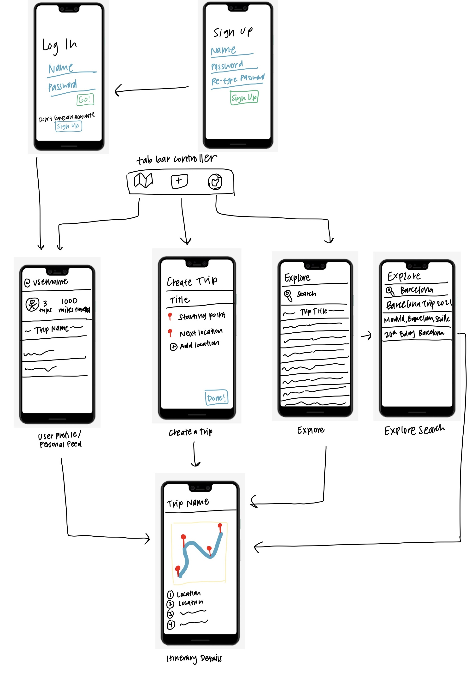

# TickIt

## Table of Contents
1. [Overview](#Overview)
1. [Product Spec](#Product-Spec)
1. [Wireframes](#Wireframes)
2. [Schema](#Schema)

## Overview
### Description
TickIt is a travel scrapbook and planner. It allows users to input destinations from their travels, and maps out their journey on Google Maps. They can then tap various locations to add descriptions from a specific place. They will also have the option to make their itinerary private, so that it can be hidden from other users in the "Discover" page. Users can view featured, nearby, and most saved trips, and also interact with trips by adding comments

### App Evaluation
- **Category:** Travel, Social, Lifestyle
- **Mobile:** Uses Google Maps API to map out the user's itinerary and they can tap on a specific location on their journey, and add pictures from their photo album.
- **Story:** Allows users to save details/memorabilia from their trips and also assists in planning future trips.
- **Market:** Anyone that travels can enjoy this app. They can plan and save travel itineraries, and share them with other people, making it a more personable and interactive experience.
- **Habit:** This would mainly be used before, during, and after a planned trip. This app is more habit forming with an explore page, allowing users to endlessly scroll through various travel destinations and itineraries.
- **Scope:** A narrow focused version of this app would be the ability to add  locations from a trip, formulate the journey on Google Maps, and being able to share the itinerary for public viewing on the explore page. Additional features would include adding pictures for each location and displaying trip metrics (miles driven, hours traveleld, etc.).

## Product Spec

### 1. User Stories (Required and Optional)

**Required Must-have Stories**

- [x] User can create a new account
- [x] User can login
- [x] User can "Create a New Trip"
- [x] User can add locations from their trip
- [x] User can generate a map with trip route based on locations (Google Maps API)
- [x] User can view feed of their itineraries
- [x] User can open a detailed view of existing itinerary

**Optional Nice-to-have Stories**

- [x] User can make their trip private
- [x] User can see their itinerary and other user's itineraries in the Explore page, if public
- [x] User can double tap to save other users' itineraries
- [x] User can search in the Explore page to find other users' itineraries
- [x] User can view trip metrics
- [x] User can use autocomplete to find locations
- [x] User can click on the marker info window to add descriptions to each location
- [x] User can discover trips from various categories (featured, nearby, most saved)
- [x] User can filter nearby trips
    - [x] Filter by miles
    - [x] Sort Nearest to Farthest, and Farthest to Nearest
    - [x] User can either filter by current location or a specific location
- [x] User can comment on trip itineraries
- [x] User can share their or other users' trips
- [x] User can choose an image from their gallery to set as a cover image for the trip

### 2. Screen Archetypes

* Login Screen
   * User can login
* Registration Screen
   * User can create a new account
* Personal Feed
    * User can view feed of their itineraries
* Itinerary Details
    * User can view a detailed view of existing itinerary
* Creation
    * User can "Create a New Trip"
    * User can add locations from their trip

### 3. Navigation

**Tab Navigation** (Tab to Screen)

* Personal Feed
* Itinerary Details
* Create a Trip

**Flow Navigation** (Screen to Screen)

* Login Screen
   * Personal Feed
* Registration
   * Personal Feed
* Personal Feed
    * Itinerary Details
    * Create a Trip
* Create a Trip
    * Personal Feed (after finishing posting trip)
* Itinerary Details
    * Personal Feed
    * Create a Trip

## Wireframes

## Schema
### Models
**User Table**
| Property | Type   | Description                            |
|----------|--------|----------------------------------------|
| objectId | String | unique id for the user (default field) |
| username | String | unique name for user                   |
| password | String | code for user to login into account    |

**Trip Table**
| Property    | Type            | Description                             |
|-------------|-----------------|-----------------------------------------|
| objectId    | String          | unique id for the trip (default field)  |
| user        | Pointer to User | unique id of user that created the trip |
| title       | String          | title of trip                           |
| description | String          | description of trip                     |
| image       | File            | cover image of trip                     |
| createdAt   | Date            | date trip was created                   |

**Trip Details Table**
| Property    | Type            | Description                                    |
|-------------|-----------------|------------------------------------------------|
| objectId    | String          | unique id for trip details (default field)     |
| trip        | Pointer to Trip | unique id of trip                              |
| location    | String          | name of location entered in trip               |
| description | String          | description of each location                   |
| index       | Number          | index of location in list of locations entered |

### Networking
* **Login**
    * **(Read/GET)** Query username and password to verify that both are a valid pair
* **Sign Up**
    * **(Create/POST)** new user
* **Profile Screen**
    * **(Read/GET)** Query logged in user object
    * **(Read/GET)** Query all of user’s trips
    * **(Update/PUT)** Update user’s trips after creating a new one
* **Create Trip Screen**
    * **(Create/POST)** Create a new trip
* **Trip Details Screen**
    * **(Read/GET)** Query trip details including each location they went to
* **Explore Screen**
    * **(Read/GET)** Query all users’ trips
    * **(Update/PUT)** Update all trips after user creates new one
